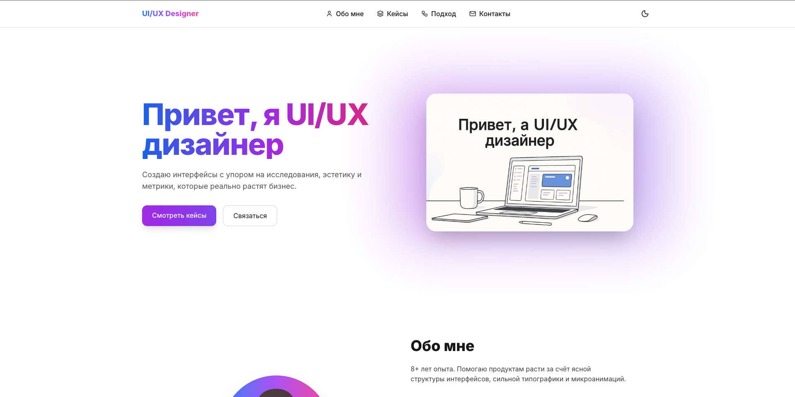
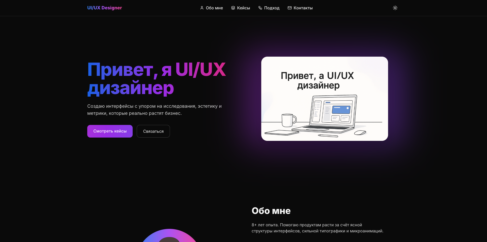

# 📌 UI/UX Designer Portfolio

Современный адаптивный сайт-портфолио для UI/UX дизайнера.
Сделан на HTML + TailwindCSS + JavaScript, с поддержкой светлой/тёмной темы, анимациями и модальными окнами.

 >  доступен [по ссылке](https://bigvovaruu.github.io/uiux-portfolio/)

---

## ✨ Функционал
 - 🎨 Адаптивный дизайн (Mobile / Tablet / Desktop).
 - 🌙 Переключатель темы (Light/Dark + смена иконки 🌙/☀️).
 - 🔥 Анимированные градиенты (Hero + CTA кнопка через JS).
 - 🖼️ Кейсы с модальными окнами (открываются с эффектом blur).
 - 🪄 Плавные анимации появления блоков при скролле.
 - 📬 Форма обратной связи (с обработкой на JS).
 - 🖋️ Кроссбраузерная типографика (чёткий текст в Chrome, Safari, Firefox, Edge, Linux, Android).

---

## 📂 Структура проекта
```bash
project-root/
│── index.html        # Главная страница
│── css/
│    └── styles.css   # Кастомные стили
│── js/
│    └── app.js       # Логика сайта
│── img/
│    ├── hero.png
│    ├── avatar.png
│    ├── case1.png
│    ├── case2.png
│    └── case3.png
└── README.md
```
## 🛠️ Технологии
 - TailwindCSS
 - Lucide Icons
 - Google Fonts – Inter
 - JavaScript (Vanilla)

---

## 📸 Скриншоты

🌞 Светлая тема


🌙 Тёмная тема


---

## 📄 Лицензия

MIT License © 2025 — свободное использование и модификация.